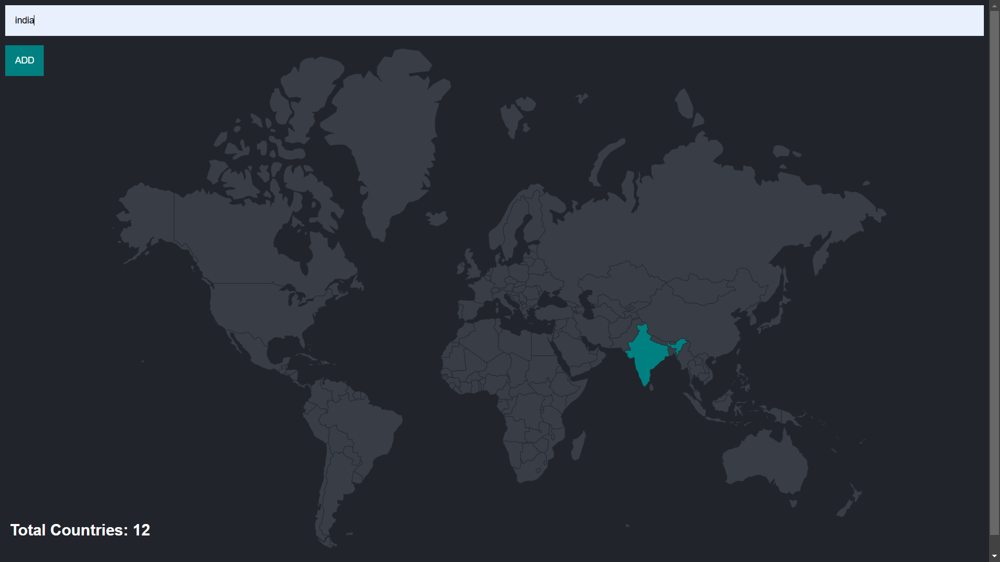

# 🌍 Travel Tracker Web App  

## 📌 Overview  
The **Travel Tracker** is a web application that allows users to **mark countries** they have visited on a **world map**. It is built using **Node.js, Express, PostgreSQL.  

## 🖼 Screenshot  
  

## 🚀 Features  
- 🗺️ **Interactive World Map**  
- 🌍 **Mark Visited Countries**  
- 📝 **Add Countries via Text Field**  
- 📊 **Database Storage (PostgreSQL)**  

## 🛠 Installation  

### **1️⃣ Clone the Repository**  
```bash
git clone <repo-url>
cd <repo-folder>
